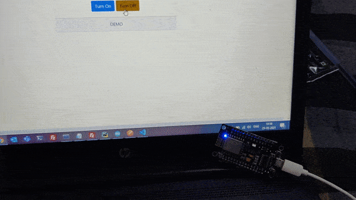
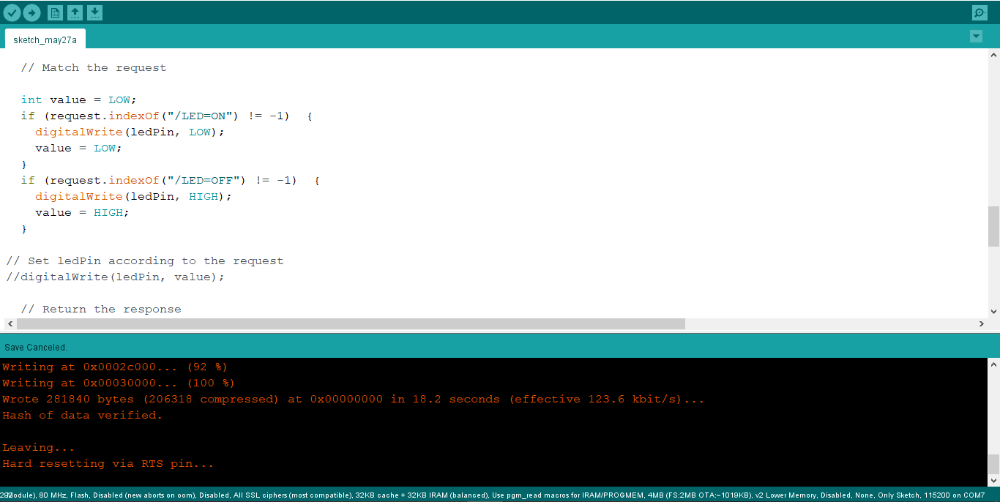
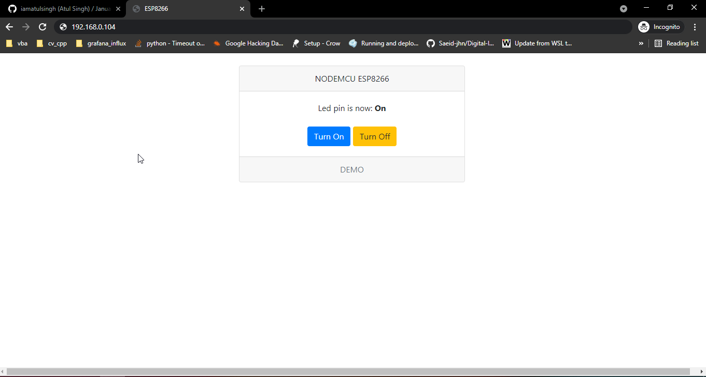

# esp8266-wifi-inbuiltled

This is a code for creating simple server using `ESP2866` wifi and control its inbuilt led light from web browser.

# How to run?

Just  copy the code and paste in `Arudiono IDE`. Change the `ssid` (your wifi name) and `password` (your wifi password) field in code and then click `upload` and Done!!

# DEMO

# Screenshots

